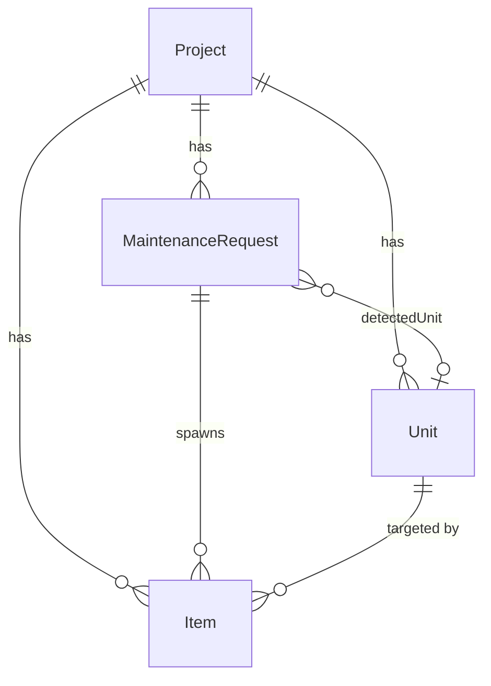
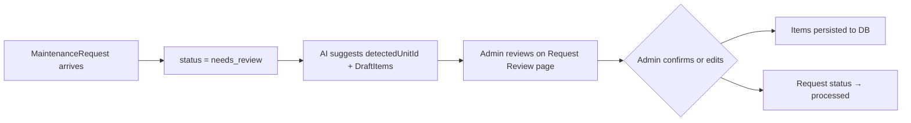

# Maintenance Portal — Domain Architecture

Reference document for the core domain model, workflows, and scope of the maintenance portal MVP.

---

## 1. Entities

All entities are defined in [`prisma/schema.prisma`](../prisma/schema.prisma) and mirrored as TypeScript interfaces in [`lib/types.ts`](../lib/types.ts).

### Project

Top-level grouping that represents a property or building.

| Field         | Type       | Notes                |
|---------------|------------|----------------------|
| `id`          | `String`   | Primary key          |
| `name`        | `String`   |                      |
| `description` | `String`   |                      |
| `createdAt`   | `DateTime` | Defaults to `now()`  |

### Unit

A rentable unit (apartment, suite, etc.) within a Project.

| Field        | Type     | Notes                      |
|--------------|----------|----------------------------|
| `id`         | `String` | Primary key                |
| `projectId`  | `String` | FK → Project               |
| `unitNumber` | `String` |                            |
| `address`    | `String` |                            |

### MaintenanceRequest

An inbound maintenance case — typically originating from a tenant or property manager.

| Field            | Type            | Notes                              |
|------------------|-----------------|------------------------------------|
| `id`             | `String`        | Primary key                        |
| `projectId`      | `String`        | FK → Project                       |
| `fromName`       | `String`        | Submitter name                     |
| `fromEmail`      | `String`        | Submitter email                    |
| `subject`        | `String`        |                                    |
| `bodyRaw`        | `String`        | Original request text              |
| `receivedAt`     | `DateTime`      |                                    |
| `status`         | `RequestStatus` | See Enums below                    |
| `detectedUnitId` | `String?`       | FK → Unit (nullable, AI-suggested) |

### Item

A discrete work item (job) spawned from a MaintenanceRequest. Each Item targets exactly one Unit.

| Field         | Type         | Notes                 |
|---------------|--------------|-----------------------|
| `id`          | `String`     | Primary key           |
| `projectId`   | `String`     | FK → Project          |
| `requestId`   | `String`     | FK → MaintenanceRequest |
| `unitId`      | `String`     | FK → Unit             |
| `title`       | `String`     |                       |
| `description` | `String`     |                       |
| `trade`       | `Trade`      | See Enums below       |
| `priority`    | `Priority`   | See Enums below       |
| `status`      | `ItemStatus` | See Enums below       |
| `createdAt`   | `DateTime`   | Defaults to `now()`   |
| `updatedAt`   | `DateTime`   | Auto-updated          |

### Contractor (future)

A contractor or vendor who can be assigned to Items. **Not yet modeled** — included here as a planned extension point.

---

## 2. Relationships

In plain terms:

- A **Project** owns many **Units**, many **MaintenanceRequests**, and many **Items**.
- A **MaintenanceRequest** spawns zero or more **Items**.
- Each **Item** belongs to exactly one **Unit** (the unit where the work is needed).
- A **MaintenanceRequest** may optionally reference a **detectedUnit** (AI-suggested, confirmed by admin).

---

## 3. Enums & Statuses

### RequestStatus

Tracks the lifecycle of a MaintenanceRequest.

| Value          | Meaning                                         |
|----------------|--------------------------------------------------|
| `needs_review` | Awaiting admin review (default for new requests) |
| `processed`    | Admin has reviewed and created Items from it     |

### ItemStatus

Tracks the lifecycle of a work Item.

| Value        | Meaning                                |
|--------------|----------------------------------------|
| `New`        | Just created, not yet assigned         |
| `Assigned`   | Assigned to a contractor (future)      |
| `InProgress` | Work is underway (DB value: `In Progress`) |
| `Completed`  | Work finished                          |
| `Closed`     | Administratively closed                |

### Trade

The type of work required.

| Value        |
|--------------|
| `Plumbing`   |
| `Electrical` |
| `Carpentry`  |
| `Painting`   |
| `Appliance`  |
| `General`    |
| `Other`      |

### Priority

| Value    |
|----------|
| `Low`    |
| `Normal` |
| `Urgent` |

---

## 4. Human Review Gate

The central design invariant: **AI can suggest, but only a human admin can create final Items.**

### Step-by-step

1. A **MaintenanceRequest** is created with `status = needs_review`.
2. AI may populate `detectedUnitId` and generate **DraftItem** objects (defined in `lib/types.ts`). These drafts live only in the client — they are **never automatically persisted**.
3. An admin opens the Request Review page, where they can:
   - Confirm or correct the detected Unit.
   - Edit, add, or remove draft Items.
4. When the admin clicks **Process**, the confirmed Items are written to the database and the request's status is set to `processed`.
5. **Key invariant:** AI produces draft suggestions only. Final Items require explicit admin confirmation via the review UI.

### Why this matters

- Prevents incorrect unit assignment from auto-creating work orders.
- Gives the admin full control over what trades, priorities, and descriptions are committed.
- Keeps an auditable boundary between AI inference and committed data.

---

## 5. Non-goals for MVP

The following are explicitly out of scope for the initial release:

- **Contractor portal** — No self-service interface for contractors to view or update their assigned Items.
- **Scheduling** — No calendar integration or time-slot booking for jobs.
- **Inbound email forwarding** — MaintenanceRequests are created via seed data or manual entry; automated email ingestion is not yet implemented.
